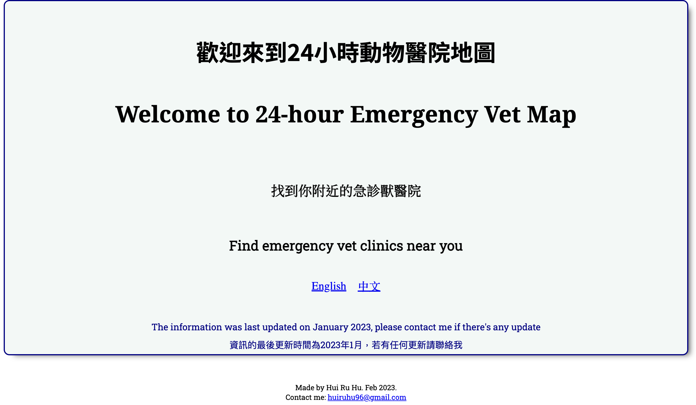
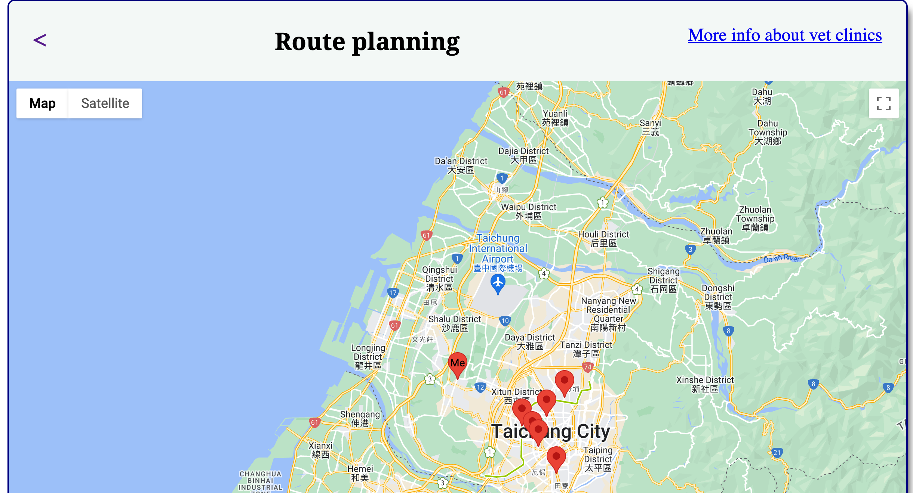
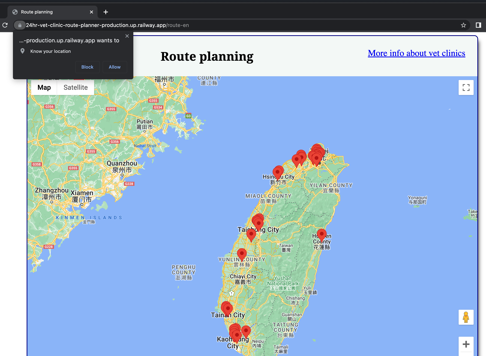
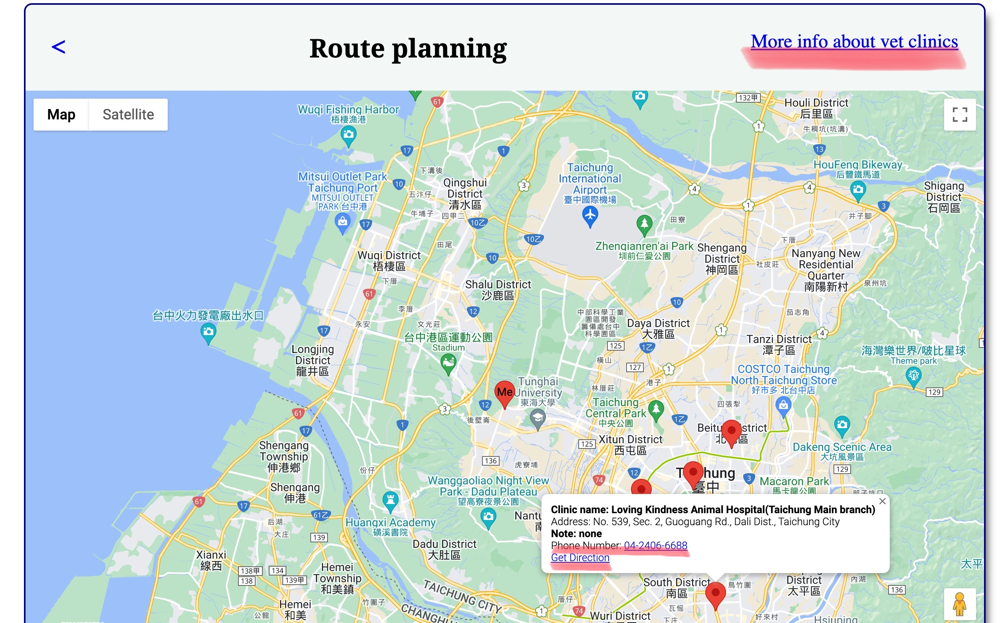
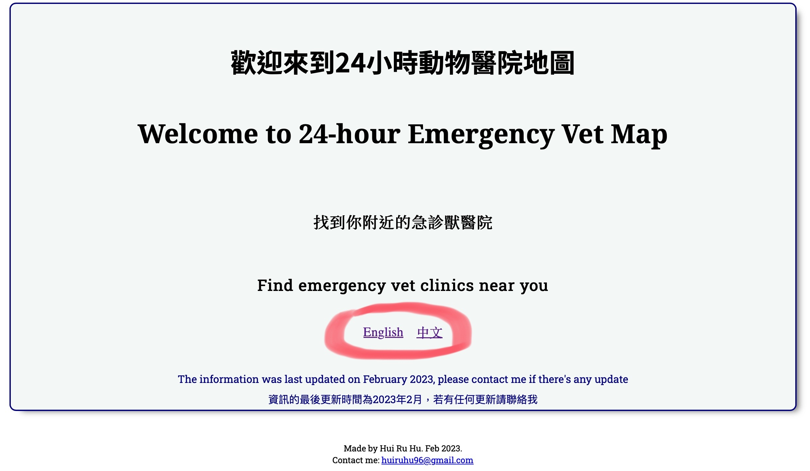
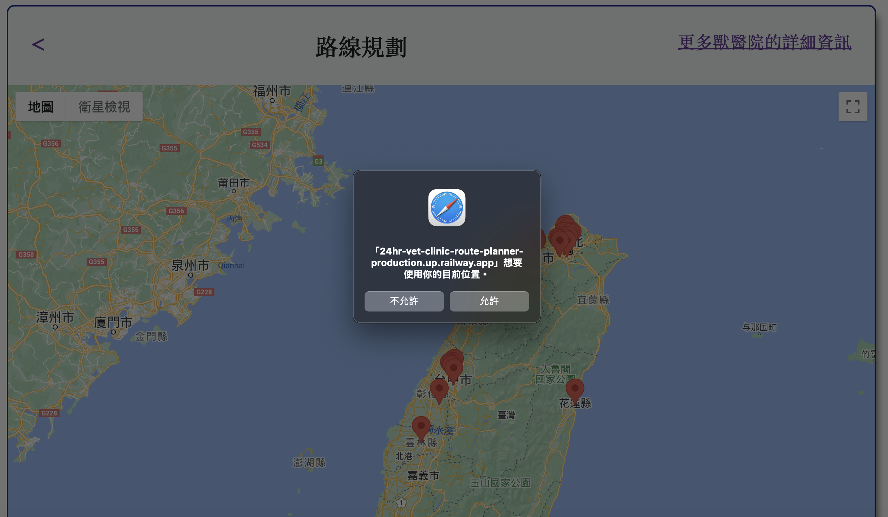
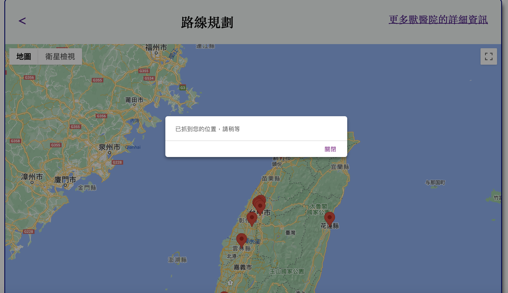
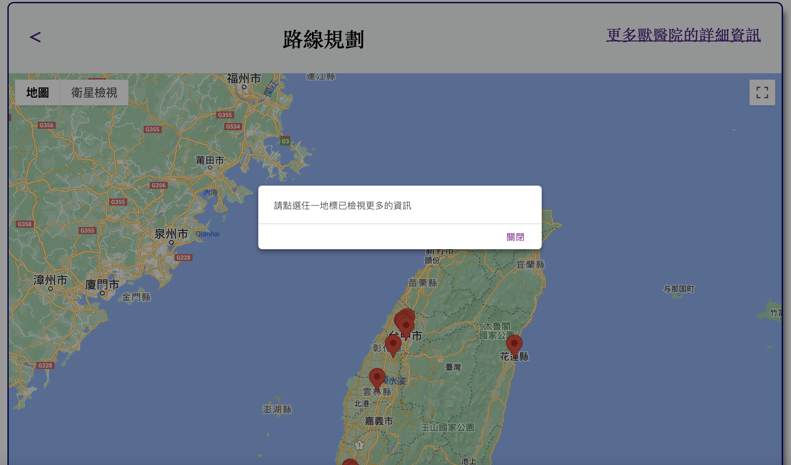
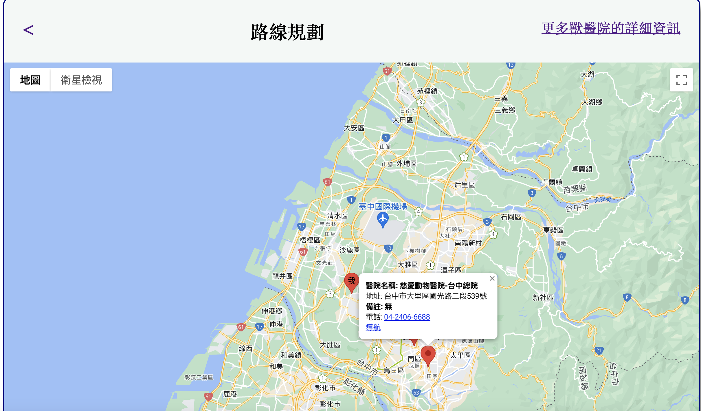

# 24HR Vet Clinic Map & Route Planner

- [24HR Vet Clinic Map \& Route Planner](#24hr-vet-clinic-map--route-planner)
  - [My Website](#my-website)
  - [English Version](#english-version)
    - [Welcome Page](#welcome-page)
    - [Tech Used](#tech-used)
    - [Introduction](#introduction)
    - [Motivation \& Goal](#motivation--goal)
    - [Key Features](#key-features)
    - [What I learnt while building this project](#what-i-learnt-while-building-this-project)
    - [Contact Me](#contact-me)
    - [The next version](#the-next-version)
  - [中文版](#中文版)
    - [專案介紹](#專案介紹)
    - [動機與目標](#動機與目標)
    - [專案重點](#專案重點)
    - [聯絡我](#聯絡我)

## My Website

<https://24hr-vet-clinic-route-planner-production.up.railway.app/>

## English Version

### Welcome Page

### Tech Used

    1. HTML
    2. CSS
    3. JavaScript(FrontEnd)
    4. Python(BackEnd)
    5. Flask
    6. Google Map API(GeoLocation API & Maps JavaScript API)
    7. Railway(Deployment)

### Introduction

When I was designing the site, in order to increase the usability, I made it as a bilingual website.

This is a site that can help you get the direction to the vet clinics nearby, as well as get the details of each of the vet clinics.

It consists of 2 major parts: the FrontEnd portion for which user can get the direction to the vet clinics and dial the phone number of the vet clinics by simply clicking the markers on the map; the BackEnd portion, converts the csv files, which stores all the information about the vet clinics, generates the latitude and longitude of the vet clinics and stores them as json formats to support the FrontEnd's need to generate the maps.

### Motivation & Goal

In my opinion it's important to always have a copy of emergency vet clinics just in case we will need it someday. When I was researching about it, I realize that there's not much English information, so I think why don't I create a digital copy of all the information and also make it accessible for both Mandarin speaker and English speaker. By building/creating this site, I hope it will help whoever is in need 🙂!

### Key Features

1. Get the direction to emergency vet clinics base on users location: by clicking the marker on the map, an information window will pop up. If "Get Direction" link is clicked user will be guided to google map for direction. User can also call the vet clinics by clicking the phone number.

   

   

   

2. Bilingual support: choose preferable language at the welcome page of the site.

   

3. Find the detail information of emergency vet clinics by clicking "More Info bout vet clinics"

### What I learnt while building this project

    - Working with Google Map APIs -> add maps and markers
    - FrontEnd BackEnd integration -> working with JavaScript and Python
    - building a bilingual website
    - Responsive Website Design -> How to make my website user friendly for different screen types
    - Better my JavaScript skill

### Contact Me

If there's any bug or info updates, please don't hesitate to contact me via [Gmail]<huiruhu96@gmail.com>

### The next version

    - UI improvement
    - Info update

---

## 中文版

### 專案介紹

為了增加網站的能見度和實用性，我最初在設計網站時便把網站涉及成雙語網站，以便在台灣的中文以及英文使用者都能夠順暢的運用它，它藉由抓取使用者定位的方式，讓使用者們能夠得到所在位置附近的急診獸醫院資料，進而打電話進行詢問和導航到目的地。

整個專案主要能分為兩個部分，分別是以 JavaScript 為主要邏輯的前端；以及以 Python 和 Flask 統整資料的後端。後端主要負責將 CSV 檔將每一個獸醫院的地址利用 Google Map API 的運算以產生經緯度並重新儲存於新的 CSV 檔中，最後再轉換成 JSON 格式供前端的 JavaScript 使用
；而前端則是負責將由後端而來的 JSON 格式的資料，藉由 Map JavaScript API 的轉處理成為 marker 的 Info window，並將 marker 放置於地圖上。

### 動機與目標

前陣子，我計劃將全台灣的急診獸醫院資料搜集起來以備不時之需。雖然這是一個平常不想要用到的清單，但卻有其必要性，於是我開始整理，不過卻發現英文的資料少之又少，因此我想：既然我偶不錯的英文能力也會寫程式，那不如就把資料彙整成一個大家都能用的地圖網站吧，而後便耗時約一個半月整理中英文資料並且建置網站。希望飼主們能夠藉由這個網站的資料更即時的讓需要醫療的動物們獲得照顧。

### 專案重點

1. 根據使用者所在之位置取得最近的獸醫院: 在取得使用者的位置後，當使用者點選任一 marker 即可得到獸醫院之詳細資訊，可導航至所選之獸醫院（會連結至 google map 於另一個視窗開啟導航頁面），也可以點選電話號碼直接撥打至獸醫院。

   

   

   

   

2. 中英文雙語頁面: 可於首頁選取中文或英文。

   

3. 點選“更多獸醫院的詳細資訊”即可查看全台有提供急診的獸醫院資訊

### 聯絡我

若有任何的修改建議或是資訊更新，歡迎用[Gmail]<huiruhu96@gmail.com>聯絡我喔！
